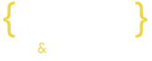

# Hello visitors & recruiters 👋

[](https://www.linkedin.com/in/jakub-flis-789785178/)

What you see it will be my portfolio website. In this page you will see information about:
-[x] me
-[x] my tech stack
-[x] soft skills
-[x] experience
-[x] my projects
-[x] my hobbies


## Here is a link to the [page](https://iflisek.com) 
[](https://iflisek.com)

> [FIGMA PROJECT - work in progress](https://www.figma.com/file/zfS81auOUq3jaUqfpPYio8/Portfolio-project?type=design&node-id=736%3A4301&mode=design&t=dZN9GSGgwttwckoK-1)

#### Of course, the entire website will be developed and will have subsequent phases 
> ( __which ones?__ I don't know yet, because it's still being created in my head )

# App Stack
    

```typescript
type TechStack = {
  tech: string;
  framework: string;
  projectUI: string;
  ui: string[];
  deploy: string;
};

const appStack: TechStack = {
  tech: "Typescript",
  framework: "Next.js v14.1",
  projectUI: "Figma",
  ui: [ "styled-components", "Storybook" ],
  deploy: "Vercel",
};
```
In the project I use node `version above ^20`.
```bazaar
nvm use 20
```
```npm
npm install
```
```npm
npm run dev
```
